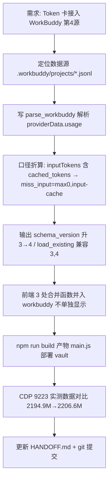

# HANDOFF — Smart Dashboard v4.4.0（WorkBuddy 第 4 数据源接入）

> 本次交接聚焦：Token 用量卡片接入第 4 个数据源 WorkBuddy（DSH 桌面客户端）。严格套用《06_项目交接文档模板》8 节结构。

## 1. 项目概况与当前状态
- **项目名称：** Smart Dashboard（Obsidian 插件，id: `obsidian-smart-dashboard`）
- **项目目标：** 在 Obsidian 侧边栏提供统一智能看板，聚合日历/待办/日程/Token 用量/订阅额度等卡片，以 Knowledge OS 方式整合笔记与时间管理。
- **当前阶段：** WorkBuddy 第 4 源接入开发完成，`collect_usage.py` / `main.ts` / `main.js` 均已改好并部署到 vault 实测通过；**本次改动尚未提交 git**；Obsidian 当前以调试模式运行（`--remote-debugging-port=9223`）。
- **版本：** 交接版本 **v4.4.0**（manifest.json 仍为 4.3.3，是否同步 bump [待确认]）
- **作者：** kroetz　**仓库：** https://github.com/billikroetzlyr43-eng/obsidian-smart-dashboard　**分支：** main

## 2. 任务执行全流程结构图 (Mermaid Workflow)

## 3. 治理/交付核心成果与数据对比 (Metrics & Data Comparison)
| 指标/维度 | 治理/执行前状态 | 治理/执行后状态 | 优化效果与说明 |
| :--- | :---: | :---: | :--- |
| **Token 用量数据源数** | 3（hermes/dsh/opencode） | **4（+workbuddy）** | 新增 WorkBuddy DSH 桌面客户端采集源 |
| **本月消耗（2026-08-19 实测）** | 2194.9M | **2206.6M** | +11.7M（WorkBuddy 贡献约 8.1M，余量为其他源新增/重算） |
| **WorkBuddy 本月贡献明细** | 未采集 | **约 8.1M** | input 43.5万 / output 8.7万 / cache 754万 / reasoning 3.8万 / calls 129 |
| **输出 schema_version** | 3 | **4** | days 新增 workbuddy 子键；load_existing 兼容 3 与 4 |
| **前端显示口径** | 三源合计 | **四源合计（不单列）** | allTotalWithCache/cacheStats/dailyTokens 三处并入 workbuddy，总量口径不变 |
| **受影响文件数** | - | **4+1** | collect_usage.py / main.ts / main.js / HANDOFF.md（+ .gitignore） |

## 4. 已完成工作 (Completed)
- **核心功能/交付物：**
  - [x] `collect_usage.py` 新增 `parse_workbuddy()`，遍历 `C:/Users/华为/.workbuddy/projects/**/*.jsonl`
  - [x] 口径折算：WorkBuddy `inputTokens` 已含 `cached_tokens` → 存 `miss_input = max(0, inputTokens - cache)`，与 dsh/opencode 对齐
  - [x] 输出 `schema_version` 升至 4；`load_existing` 兼容 schema 3 与 4（旧数据可读）
  - [x] `main.ts` 3 处合并函数并入 workbuddy（不单独显示）：`allTotalWithCache` / `cacheStats` / `dailyTokens`
  - [x] `main.js` 构建产物已生成并部署到 vault 插件目录
  - [x] CDP 9223 实测数据正确并入（见第 3 节对比表）
- **关键代码/文件路径：**
  - `collect_usage.py` — 采集脚本：`WORKBUDDY_PROJECTS_DIR` 常量(L42)、`parse_workbuddy()`(L179-252)、`main()` 四源合并(L318-353)、`load_existing` 兼容(L298-307)
  - `main.ts` — 前端渲染：`allTotalWithCache()`(L2718)、`cacheStats()`(L2759)、`dailyTokens()`(L2789)
  - `main.js` — 构建产物（已部署到 `D:/Obsidian Vault/Obsidian Vault/.obsidian/plugins/obsidian-smart-dashboard/`）
- **技术方案与架构：**
  - 数据位置：`C:/Users/华为/.workbuddy/projects/**/*.jsonl`，token 在 `evt.providerData.usage`（**非** `evt.usage`、**非** `evt.data.usage`）
  - 缓存口径：WorkBuddy `inputTokens` 为 OpenAI 风格（含 `cached_tokens`），从 `inputTokensDetails[].cached_tokens` 求和得 cache，再 `miss_input = max(0, inputTokens - cache)`；output/reasoning 直接取
  - 前端"不单独显示 WorkBuddy"：仅在三个合并函数把 `workbuddy.input/output/cache/reasoning` 并入总量，UI 小分类仍按 v4.3.3 只显示输入+输出

## 5. 待办事项与下一步行动 (Next Steps)
- **优先级最高（启动后立即执行）：**
  - [ ] 完成本次 git 提交（collect_usage.py / main.ts / main.js / HANDOFF.md / .gitignore）并 `git push origin main`
  - [ ] [待确认] manifest.json（4.3.3）与 package.json 是否同步 bump 至 4.4.0；本次按"禁止改功能代码"未动两者
- **后续规划：**
  - [ ] 观察 WorkBuddy 数据稳定性（`session_usage.used` vs `providerData.usage` 是否有重叠/漂移）
  - [ ] 评估是否为 WorkBuddy 加 `cache_write` 维度（当前 schema v4 未单独采集，与 opencode 不一致）
  - [ ] 考虑把 `.workbuddy` 数据源位置纳入设置项（当前硬编码在 collect_usage.py）

## 6. 踩坑记录与避坑指南 (Lessons Learned & Pitfalls)
- **已踩过的坑：**
  - WorkBuddy 的 `inputTokens` **已包含 `cached_tokens`**（OpenAI 风格），若不折算直接计入 input，会导致 cache 与 input 重复计 → 总量虚高。已用 `miss_input = max(0, inputTokens - cache)` 折算对齐 dsh/opencode。
  - WorkBuddy 的 `workbuddy.db` 中 `session_usage.used` 字段是**上下文窗口占用**（单次会话峰值），**不是累计 token 消耗**，不能用来做用量统计；必须用 `*.jsonl` 里 `providerData.usage` 才是真实计费口径。
  - `obs_cdp_restart.py` 重启 Obsidian 调试模式时缺 `--remote-allow-origins=*` 参数 → CDP 9223 端口连接返回 403；必须带该参数才能被外部 CDP 客户端访问。
  - 刷新机制已无 cron（v4.3.2 已删 cron 任务 `b9e7918def15`）：Token 卡刷新按钮 `exec collect_usage.py --quiet` 主动采集；卡片打开与每 5 分钟定时只重读 JSON 渲染（不触发采集）。
- **已知 Bug / 限制：**
  - WorkBuddy 数据依赖其 jsonl 持续落盘；WorkBuddy 客户端未运行或目录变更时，`parse_workbuddy` 会 WARN 返回 `{}`（不影响其他源）
  - schema v3→v4 向后兼容靠 `load_existing`，但若 days 内已有 workbuddy 键又被旧版脚本覆盖会丢数据；升级后避免回退到 v3 脚本

## 7. 项目规范与硬性约束 (Rules & Constraints)
- **代码/文件规范：**
  - 提交身份固定为 kroetz；远端 origin 已配凭据 store
  - commit message 遵循 `vX.Y.Z: 描述` 格式
  - Python 采集脚本依赖 zstandard（自动从清华源 pip install）；输出固定写到 `D:/Obsidian Vault/Obsidian Vault/.smart-dashboard/usage_daily.json`
  - 构建命令 `npm run build`；产物 main.js 部署到 vault 插件目录
  - `__pycache__/` 不入库（Python 字节码缓存）
- **业务/逻辑底线：**
  - Token 总量口径不可破：input/output/cache/reasoning 四维全口径相加（月/今日/本周/累计一致）
  - 新数据源接入必须做"含不含 cache"的口径对齐，否则总量失真
  - 前端小分类按 v4.3.3 决议只显示"输入+输出"（缓存命中率作为独立指标行保留），不新增单独数据源列

## 8. 断点快照 (Current State Snapshot)
- **上次停下的位置：**
  - 代码改动已完成：`collect_usage.py`（parse_workbuddy / schema v4）、`main.ts`（3 处合并函数）、`main.js`（已部署 vault 实测）
  - 本次改动**尚未 git commit**；HANDOFF.md 已按 v4.4.0 更新
  - Obsidian 当前以调试模式运行（`--remote-debugging-port=9223`，CDP 可连）
- **遗留待确认问题：**
  - [待确认] manifest.json / package.json 版本是否同步 bump 至 4.4.0（本次未动）
  - [待确认] push 是否能成功（远端 origin 凭据 store 已配，但若遇网络失败本地 commit 仍需保留）
  - 本次实测对比数据（2194.9M vs 2206.6M、WorkBuddy 8.1M 明细）为 2026-08-19 当日快照，后续会随采集变化

---

> 关联工作流：[[10_项目交接与上下文维持工作流]]

---

## 附录：历史版本摘要
- **v4.3.3**：Token 卡小分类只显示输入+输出；刷新保留面板不清空、状态文字移按钮右侧
- **v4.3.2**：移除主题切换按钮；Token 卡刷新直连采集（去 cron）
- **v4.3.1**：深色模式文字显示不清修复（颜色源统一为 Obsidian 核心变量）
- **v4.3.0**：卡片开关与自动补位布局（`SmartDashboardSettingTab` + `reflowLayoutForVisibleCards`）
