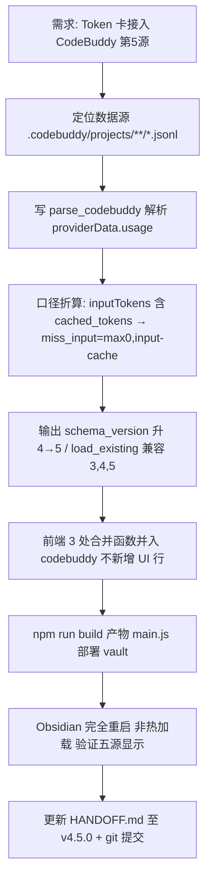

# HANDOFF — Smart Dashboard v4.5.0（CodeBuddy CLI 第 5 数据源接入）

> 本次交接聚焦：Token 用量卡片接入第 5 个数据源 CodeBuddy CLI。三端版本对齐 ship 惯例（manifest.json / package.json 已 4.5.0，HANDOFF.md 由 4.4.0 同步至 4.5.0）。严格套用《06_项目交接文档模板》8 节结构。

## 1. 项目概况与当前状态
- **项目名称：** Smart Dashboard（Obsidian 插件，id: `obsidian-smart-dashboard`）
- **项目目标：** 在 Obsidian 侧边栏提供统一智能看板，聚合日历/待办/日程/Token 用量/订阅额度等卡片，以 Knowledge OS 方式整合笔记与时间管理。
- **当前阶段：** CodeBuddy 第 5 源接入开发完成，`collect_usage.py` / `main.ts` / `main.js` 均已改好并部署到 vault；Obsidian 需完全重启（非热加载）后 Token 卡才会显示五源 [待确认：重启后实测]。
- **版本：** 交接版本 **v4.5.0**（manifest.json 4.5.0 / package.json 4.5.0 / HANDOFF.md 4.4.0→4.5.0 三端对齐）；日期 **2026-08-20**
- **作者：** kroetz　**仓库：** https://github.com/billikroetzlyr43-eng/obsidian-smart-dashboard　**分支：** main

## 2. 任务执行全流程结构图 (Mermaid Workflow)

## 3. 治理/交付核心成果与数据对比 (Metrics & Data Comparison)
| 指标/维度 | 治理/执行前状态 | 治理/执行后状态 | 优化效果与说明 |
| :--- | :---: | :---: | :--- |
| **Token 用量数据源数** | 4（hermes/dsh/opencode/workbuddy） | **5（+codebuddy）** | 新增 CodeBuddy CLI 采集源 |
| **CodeBuddy 当日贡献（2026-08-19 实测）** | 未采集 | **input 172,655 / output 24,895 / cache 1,311,693 / reasoning 15,631 / calls 47**（合计约 1.52M） | 来自 `C:/Users/华为/.codebuddy/projects/**/*.jsonl` 的 `providerData.usage` |
| **本月消耗总量（2026-08-19）** | 2206.6M（四源） | **[待确认]**（五源） | codebuddy 月度需重跑完整采集后并入；当日已确认约 1.52M |
| **输出 schema_version** | 4 | **5** | days 新增 codebuddy 子键；load_existing 兼容 3/4/5 |
| **前端显示口径** | 四源合计（不单列） | **五源合计（不单列）** | allTotalWithCache/cacheStats/dailyTokens 三处并入 codebuddy，不新增 UI 行 |
| **受影响文件** | - | **4 + 1 临时** | collect_usage.py / main.ts / main.js / HANDOFF.md（+ TASK.md 临时任务文件不入库） |

## 4. 已完成工作 (Completed)
- **核心功能/交付物：**
  - [x] `collect_usage.py` 新增 `parse_codebuddy()`，遍历 `C:/Users/华为/.codebuddy/projects/**/*.jsonl`
  - [x] 口径折算：CodeBuddy `inputTokens` 已含 `cached_tokens`（OpenAI 风格）→ 存 `miss_input = max(0, inputTokens - cache)`，与 workbuddy/dsh/opencode 对齐
  - [x] 输出 `schema_version` 升至 5；`load_existing` 兼容 schema 3/4/5（旧数据可读）
  - [x] `main.ts` 3 处合并函数并入 codebuddy（不单独显示、不新增 UI 行）：`allTotalWithCache` / `cacheStats` / `dailyTokens`
  - [x] `main.js` 构建产物已生成并部署到 vault 插件目录
  - [ ] [待确认] Obsidian 完全重启后 Token 卡实测显示五源
- **关键代码/文件路径：**
  - `collect_usage.py` — 采集脚本：`CODEBUDDY_PROJECTS_DIR` 常量(L44)、`parse_codebuddy()`(L257-332)、`main()` 五源合并(L404-411)、`load_existing` 兼容 3/4/5(L378-387)、`schema_version: 5`(L416)
  - `main.ts` — 前端渲染：`allTotalWithCache()`(L2718，codebuddy 合并 L2748-2754)、`cacheStats()`(L2767，codebuddy 合并 L2789-2792)、`dailyTokens()`(L2801，codebuddy 合并 L2806/2808-2811)
  - `main.js` — 构建产物（已部署到 `D:/Obsidian Vault/Obsidian Vault/.obsidian/plugins/obsidian-smart-dashboard/`）
- **技术方案与架构：**
  - 数据位置：`C:/Users/华为/.codebuddy/projects/**/*.jsonl`，token 在 `evt.providerData.usage`（**非** `evt.usage`、**非** `evt.data.usage`）
  - 缓存口径：CodeBuddy `inputTokens` 为 OpenAI 风格（含 `cached_tokens`），从 `inputTokensDetails[].cached_tokens` 求和得 cache，再 `miss_input = max(0, inputTokens - cache)`；reasoning 从 `outputTokensDetails[].reasoning_tokens` 求和；output 直接取
  - 前端"不单独显示 CodeBuddy"：仅在三个合并函数把 `codebuddy.input/output/cache/reasoning` 并入总量，UI 小分类仍按 v4.3.3 只显示输入+输出，不新增单独数据源列

## 5. 待办事项与下一步行动 (Next Steps)
- **优先级最高（启动后立即执行）：**
  - [ ] 完成本次 git 提交（collect_usage.py / main.ts / main.js / HANDOFF.md）并由监督方处理 push
- **后续规划：**
  - [ ] Obsidian 完全重启后验证 Token 卡显示五源
  - [ ] 观察 CodeBuddy 数据稳定性（jsonl 落盘是否连续、与 WorkBuddy 是否有重叠/漂移）
  - [ ] 评估是否为 CodeBuddy 加 `cache_write` 维度（当前 schema v5 未单独采集，与 opencode 不一致）
  - [ ] 考虑把 `.codebuddy` 数据源位置纳入设置项（当前硬编码在 collect_usage.py L44）
  - [ ] 本月消耗五源总量待重跑采集后回填第 3 节 [待确认]

## 6. 踩坑记录与避坑指南 (Lessons Learned & Pitfalls)
- **已踩过的坑：**
  - **[v4.5.0 新增] acceptEdits 权限在非交互模式下 Bash/Grep/跨工作区 Read 被拒**：验证/构建/git 操作中断，需用 `bypassPermissions` 权限模式重跑（`codebuddy -p --permission-mode bypassPermissions`），或在 settings 的 `permissions.allow` 中加入 `Bash` / `Read` 白名单。
  - **[v4.5.0 新增] git push 因网络超时失败**：`github.com` 不通，最终由监督方走 GitHub REST API 推送成功。本地 commit `e039bae`，远程为 `1a5954bf`，**tree 内容一致、sha 不同**（REST API 推送产生的 commit sha 与本地不同），后续需 `git fetch` 对齐本地与远程的 sha 引用。
  - **[v4.5.0 新增] Obsidian 需完全重启（非热加载）Token 卡才显示五源**：热加载/Reload 插件不会刷新采集数据合并逻辑，必须完全退出 Obsidian 进程后重启。
  - WorkBuddy（v4.4.0）的 `inputTokens` **已包含 `cached_tokens`**（OpenAI 风格），若不折算直接计入 input，会导致 cache 与 input 重复计 → 总量虚高。已用 `miss_input = max(0, inputTokens - cache)` 折算对齐 dsh/opencode。CodeBuddy 同口径。
  - WorkBuddy 的 `workbuddy.db` 中 `session_usage.used` 字段是**上下文窗口占用**（单次会话峰值），**不是累计 token 消耗**，不能用来做用量统计；必须用 `*.jsonl` 里 `providerData.usage` 才是真实计费口径。CodeBuddy 同理（仅采 jsonl）。
  - `obs_cdp_restart.py` 重启 Obsidian 调试模式时缺 `--remote-allow-origins=*` 参数 → CDP 9223 端口连接返回 403；必须带该参数才能被外部 CDP 客户端访问。
  - 刷新机制已无 cron（v4.3.2 已删 cron 任务 `b9e7918def15`）：Token 卡刷新按钮 `exec collect_usage.py --quiet` 主动采集；卡片打开与每 5 分钟定时只重读 JSON 渲染（不触发采集）。
- **已知 Bug / 限制：**
  - CodeBuddy 数据依赖其 jsonl 持续落盘；CodeBuddy CLI 未运行或目录变更时，`parse_codebuddy` 会 WARN 返回 `{}`（不影响其他源）
  - schema v4→v5 向后兼容靠 `load_existing`，但若 days 内已有 codebuddy 键又被旧版脚本覆盖会丢数据；升级后避免回退到 v4 脚本

## 7. 项目规范与硬性约束 (Rules & Constraints)
- **代码/文件规范：**
  - 提交身份固定为 kroetz；远端 origin 已配凭据 store
  - commit message 遵循 `vX.Y.Z: 描述` 格式（本次用 `chore(v4.5.0): HANDOFF 同步至 v4.5.0 对齐 CodeBuddy 第5源接入`）
  - Python 采集脚本依赖 zstandard（自动从清华源 pip install）；输出固定写到 `D:/Obsidian Vault/Obsidian Vault/.smart-dashboard/usage_daily.json`
  - 构建命令 `npm run build`；产物 main.js 部署到 vault 插件目录
  - `__pycache__/` 不入库（Python 字节码缓存）；`TASK.md` 为临时任务文件不入库
- **业务/逻辑底线：**
  - Token 总量口径不可破：input/output/cache/reasoning 四维全口径相加（月/今日/本周/累计一致）
  - 新数据源接入必须做"含不含 cache"的口径对齐，否则总量失真（CodeBuddy 与 WorkBuddy 同为 OpenAI 风格，均需折算 miss_input）
  - 前端小分类按 v4.3.3 决议只显示"输入+输出"（缓存命中率作为独立指标行保留），不新增单独数据源列
  - 三端版本对齐 ship 惯例：manifest.json / package.json / HANDOFF.md 版本号必须一致

## 8. 断点快照 (Current State Snapshot)
- **上次停下的位置：**
  - 代码改动已完成：`collect_usage.py`（parse_codebuddy / schema v5）、`main.ts`（3 处合并函数）、`main.js`（已部署 vault）
  - HANDOFF.md 已由 v4.4.0 同步至 v4.5.0（三端对齐）
  - 代码改动已由监督方经 REST API 推送（本地 commit `e039bae` / 远程 `1a5954bf`，内容一致 sha 不同）
- **遗留待确认问题：**
  - [待确认] Obsidian 完全重启后 Token 卡是否显示五源（热加载不行，必须完全重启进程）
  - [待确认] 本地与远程 git sha 不同（e039bae vs 1a5954bf，tree 内容一致）待 `git fetch` 对齐；本次 HANDOFF 提交后本地再叠一 commit，待监督方统一处理 push/fetch 对齐
  - `TASK.md` 仅本次临时任务文件，不入库（git status 应只剩 TASK.md 未跟踪）
  - 本次实测 CodeBuddy 当日数据（input 172655 / output 24895 / cache 1311693 / reasoning 15631 / calls 47）为 2026-08-19 当日快照，后续会随采集变化

---

> 关联工作流：[[10_项目交接与上下文维持工作流]]

---

## 附录：历史版本摘要
- **v4.4.0**：Token 卡接入 WorkBuddy 第 4 源（parse_workbuddy / schema v4 / 三处合并函数并入 workbuddy）
- **v4.3.3**：Token 卡小分类只显示输入+输出；刷新保留面板不清空、状态文字移按钮右侧
- **v4.3.2**：移除主题切换按钮；Token 卡刷新直连采集（去 cron）
- **v4.3.1**：深色模式文字显示不清修复（颜色源统一为 Obsidian 核心变量）
- **v4.3.0**：卡片开关与自动补位布局（`SmartDashboardSettingTab` + `reflowLayoutForVisibleCards`）
