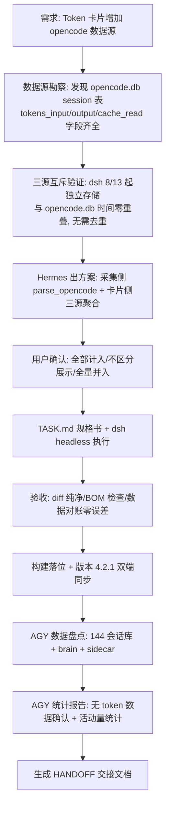

# 🚀 项目交接文档 (HANDOFF.md) — Smart Dashboard Token 三源统计 + 布局压缩 + 版本 4.2.1

> 生成时间：2026-08-16 17:15（增写 17:45）｜ 依据工作流：10_项目交接与上下文维持工作流 ｜ 模板：06_项目交接文档模板
> 本交接覆盖 2026-08-16 00:12 的 v4.2.0 交接（磁贴化重构已完成，历史内容见第 4 节）
> **增写说明**：17:15 初版后新增「年视图截断修复 + Token 卡布局压缩」迭代（见第 4 节"本轮迭代修复"）

## 1. 项目概况与当前状态

- **项目名称：** obsidian-smart-dashboard（Obsidian 插件，源码 `D:\workspace\01_Projects\obsidian-smart-dashboard\`，构建产物自动分发至 vault `.obsidian\plugins\obsidian-smart-dashboard\`）
- **项目目标：** Token 用量卡片升级为 **hermes + dsh + opencode 三源聚合**（原两源），版本 4.2.0 → **4.2.1**；附带完成 Antigravity（AGY）历史数据盘点与一次性使用统计报告
- **当前阶段：** 三源改造 100% 完成（dsh 交付 → diff/BOM 验收 → 落位 → 构建 → 数据对账通过）；版本号双端同步完成；**唯一待办为用户侧 Obsidian 重载确认**

## 2. 任务执行全流程结构图 (Mermaid Workflow)

## 3. 治理/交付核心成果与数据对比 (Metrics & Data Comparison)

| 指标/维度 | 改动前状态 (v2 schema, 两源) | 改动后状态 (v2 schema, 三源) | 优化效果与说明 |
| :--- | :---: | :---: | :--- |
| **数据源数** | hermes + dsh 两源 | **hermes + dsh + opencode 三源** | opencode CLI 直跑会话（free/opencode-go/deepseek 官方 provider 全计入） |
| **opencode 覆盖** | 无 | **297 sessions 全量历史**（2026-05-24 起 38 天） | input 53.7M / output 4.56M / cache 1.26B |
| **对账精度** | - | **JSON ↔ opencode.db 直查零误差** | 297/53,712,326/4,558,175/1,259,499,792 完全一致 |
| **schema_version** | 1 | **2** | 兼容旧数据（无 opencode 字段自动兜底 0） |
| **卡片聚合点** | 6 处两源相加 | **8 处三源相加**（含 cacheStats 分支+注释） | 版式不变，未加来源占比（用户确认） |
| **版本号** | 4.2.0 | **4.2.1** | manifest 源码 + vault 双端（esbuild 自动拷贝） |
| **AGY 统计** | 未调查 | **144 会话 / 3,685 次模型调用 / 20 活跃日** | 一次性报告（用户确认不进卡片，本地无 token 数据） |

## 4. 已完成工作 (Completed)

- **核心交付物（本轮 2026-08-16）：**
  - [x] **Token 卡片三源升级**：`collect_usage.py` 新增 `parse_opencode()`（sqlite3 只读连接 `file:...?mode=ro&immutable=1`，查 `session` 表 `time_created/tokens_input/tokens_output/tokens_cache_read`，毫秒时间戳按天归类，口径 input 不含 cache 与 dsh 一致，库缺失仅 WARN 不中断）；`main.ts` 8 处三源聚合（renderUsageBody 本月/今日、allTotal、sumRange、月/年热力图 inp/out、cacheStats opencode 分支同 dsh 口径、口径注释）；`schema_version` 1→2（load_existing 校验同步）
  - [x] **年视图截断修复 + Token 卡布局压缩**（用户实测反馈驱动，见第 6 节"年视图截断根因"）：①表头保持原位（撤销 `padding-top: 4px` 的 `:has` 压缩，body 顶部恢复 16px）②表头下方留白 15→6px（`#sd-usage-section .sd-section-title`）③「本月消耗」顶部 padding 10→2px ④今日行 mb 8→4px ⑤月/年切换 margin 6→3px ⑥caption 与「本周/累计」间距 10→4px（heatmap mb 6→2 + summary mt 4→2）⑦**缓存命中率并入「本周 ｜ 累计」同一行**（新容器 `.sd-usage-bottom-row`，flex space-between，左合计右命中率）——年视图总高 ~258→~225px < 268px 可用，底部行不再被裁
  - [x] **dsh 执行与验收**：TASK.md 规格书 → dsh headless 产出 deliverables/collect_usage.py.new + main.ts.new → Hermes diff 核对（只含预期改动）、BOM 检查（无）、数据对账（零误差）→ 落位 → `node esbuild.config.mjs` 构建成功（main.js 自动拷入 vault）
  - [x] **版本号 4.2.1**：manifest.json 源码 + vault 插件目录双端同步（实测确认 esbuild 脚本自动复制 manifest.json，无需手动 cp）
  - [x] **AGY 数据盘点**：定位全部 AGY 残留——`C:\Users\华为\.gemini\antigravity\`（conversations 144 个 SQLite db / 263MB、brain 146 目录 / 129MB、annotations 138、agyhub_summaries_proto.pb 207KB）、`antigravity-cli\brain\`（8 个含 transcript.jsonl）、`antigravity-ide\`、`config\sidecars\`（a_stock_conclude + news_collection）、`AppData\Roaming\Antigravity IDE\`、`AppData\Local\agy\`
  - [x] **AGY 一次性使用统计报告**（用户确认不进卡片）：144 会话全量可读（0 损坏）、总步数 10,851、模型调用 3,685 次（step_type=15）、20 活跃日（2026-07-10 ~ 08-07，另 8/16 一个异常会话疑似卸载残留 touch）、7 月 1,707 次 vs 8 月 1,978 次（8/3-8/7 占 53%）、峰值 8/6（896 次/18 会话）；sidecar：A股复盘 23 次运行（早 8-9 点 11 次 + 午 13 点 + 晚 22-23 点）、新闻采集 19 次（同节奏）；每会话平均 25.6 次调用（中位 7、最大 251）
  - [x] **skill 更新**：`llm-cost-usage-analysis` 第 7 节升级为三源链路说明（opencode.db 只读技巧、三源互斥结论）
- **关键文件路径：**
  - `D:\workspace\01_Projects\obsidian-smart-dashboard\collect_usage.py`（225 → 253 行）— 三源采集，新增 `parse_opencode()`（~L177）、OPENCODE_DB 常量（~L40）、main() 调用（~L241）
  - `D:\workspace\01_Projects\obsidian-smart-dashboard\main.ts`（2537 → 2542 行）— 三源聚合 8 处（L2348/2349/2357/2358/2391/2392/2401/2417-2420/2438/2439/2452/2453/2476/2477）
  - `D:\workspace\01_Projects\obsidian-smart-dashboard\manifest.json` — version **4.2.1**
  - 备份：`collect_usage.py.bak_20260816`、`main.ts.bak_20260816`（同目录，可回滚）
  - 输出：`D:\Obsidian Vault\Obsidian Vault\.smart-dashboard\usage_daily.json`（schema_version 2，days[date] 含 hermes/dsh/opencode 三键）
  - 采集 cron：`b9e7918def15`（`D:\Hermes\scripts\collect_usage_cron.py`，每 10 分钟 --quiet 静默采集，无需改动）
  - AGY 数据（未动，只读）：`C:\Users\华为\.gemini\antigravity\conversations\*.db` 等
- **历史已完成（v4.2.0 磁贴化重构 / v4.1.1 Token 卡片增强 / v4.1.0 日历格子 / v4.0.0 GPU 优化）：**
  - [x] 磁贴化：4 列正方形网格 + 长按 500ms 拖拽 + 推挤重排 + 布局持久化 + 等比缩放（--sd-scale）+ 年视图 365/366 格按天直排 + min-width:0 补丁 —— 详见旧版 HANDOFF 第 4 节（历史内容完整保留于 git 无记录时可用备份，项目目录旧 HANDOFF 已被本文件覆盖）
- **技术方案与架构：**
  - 三源互斥结论：dsh（8/13 起）与 opencode.db（至 8/12）时间零重叠，Hermes 走 opencode-go HTTP 不写 opencode.db → 直接相加无需去重
  - opencode 口径：tokens_input 不含 cache（同 dsh，异于 hermes）→ cacheStats 中 hit += cache, miss += input
  - AGY 数据形态：conversations/*.db 全 protobuf（steps.metadata/gen_metadata/executor_metadata 二进制无 usage），token 精确值只在 Google 侧后台；活动量口径 = step_type==15 计数

## 5. 待办事项与下一步行动 (Next Steps)

- **⚡ 优先级最高（启动后立即执行）：**
  - [ ] 用户侧验证：Obsidian `Ctrl+R` 重载插件 → 确认「⚡ Token 用量」卡片三源数字正确（含 opencode 历史）、年视图底部两行完整显示、缓存命中率与「本周/累计」同行
  - [ ] **推送到 GitHub**：本地已有 2 个 commit 待推（a5b8072 + 布局压缩/HANDOFF 增写），上次 push 遇 Connection reset，重试 `git push origin main`
- **📌 后续规划：**
  - [ ] AGY 统计报告是否存档知识库（01_Inbox 缓冲 → 提炼），`[待确认]`
  - [ ] AGY 数据后续处理：完整对话导出还原 / brain 记忆迁移 / 清理释放 ~400MB，三项任选或都做，`[待确认]`
  - [ ] 旧遗留（v4.2.0 交接）：4 轮 TASK 规格书 + HANDOFF 归档至知识库 `03_Archive\04_系统与开发归档\01_SmartDashboard升级日志\`、统计卡 2×2、交易明细行高压缩、年视图 caption 贴边微调，均 `[待确认]`

## 6. 踩坑记录与避坑指南 (Lessons Learned & Pitfalls)

- **已踩过的坑（本轮新增）：**
  - ⚠️ **年视图截断根因（v4.2.0 引入）**：磁贴化后 `.sd-card-body` 固定设计高 300px + `overflow: hidden`，年视图 365 格按天直排使热力图高度 +57px（~26→83px），总内容 ~258px 贴着 268px 可用上限，实际渲染溢出即从底部裁掉 caption/summary/cache-rate。当时只压了 caption margin（CSS 注释"问题4"）治标不治本；本次用压缩纵向留白（表头 mb 15→6、total pt 10→2、stats mb 8→4、seg 6→3、heatmap mb 6→2、summary mt 4→2）+ 底部行合并根治
  - ⚠️ **改 body 顶部 padding 会顶动表头**：`padding-top: 4px` 的 `:has(> .sd-usage-body)` 压缩把「⚡ Token 用量」整行贴到卡片顶（用户明确要求表头原位）——表头位置由 body 顶部 padding 决定，要压缩只能压表头自身 margin/padding，不能动 body 顶距
  - ⚠️ **AGY conversations db 全是 protobuf 二进制**：steps.metadata / gen_metadata / executor_metadata 均为 protobuf（gen_metadata 里还有疑似 embedding 向量数据），非 JSON——用 json.loads 直接崩（bytes 不可序列化）；grep "usage/token" 命中是二进制字节巧合，**AGY 本地无 token 数据是硬事实**，勿再尝试解析
  - ⚠️ **opencode.db 不能普通连接**：直接 `sqlite3.connect()` 会创建 sidecar/lock 文件（目录不可写时直接失败）——必须 `sqlite3.connect("file:" + path + "?mode=ro&immutable=1", uri=True)` 只读连接
  - ⚠️ **esbuild 脚本自动复制 manifest.json**（实测确认）：`node esbuild.config.mjs` 会拷贝 main.js + manifest.json + styles.css 三件套到 vault，改版本号后重跑一次构建即可双端同步，无需手动 cp
  - ⚠️ **dsh 交付回归确认**：TASK.md 强约束"必须实际写文件"有效（本轮一次成功产出完整文件）；交付物 diff 纯净、无 BOM、自查无遗漏（dsh 报告 grep 断言 0 违规）
  - ⚠️ **GitHub push 偶发 Connection reset**（2026-08-16 17:20）：`git push` 报 `Recv failure: Connection was reset`（本地无 git 代理配置），重试或稍后再试即可，非凭据问题
- **已知 Bug / 限制：**
  - 🐛 AGY 8/16 异常会话：1 个 db（25 次调用）mtime 为 08-16 17:09（AGY 8/11 已卸载），疑似卸载残留进程 touch，非正常使用
  - 🐛 AGY 日期归类基于 db 文件 mtime（近似，会话多为单日完成，误差可忽略）
  - ✅ 年视图截断已修复（2026-08-16 17:45 布局压缩，见第 4 节）；`collect_usage.py.bak_20260816` / `main.ts.bak_20260816` 本地保留可回滚，不入 git（.gitignore `*.bak`）
  - 🐛 沿用 v4.2.0 已知项：交易明细 36 行滚动显示、窄窗口 <900px 降为流式布局

## 7. 项目规范与硬性约束 (Rules & Constraints)

- **代码/文件规范：**
  - 构建必须用 `node esbuild.config.mjs`（源码目录执行），禁止 `npx esbuild`；该脚本自动同步 main.js/manifest.json/styles.css 至 vault 插件目录
  - 版本号改动：源码 manifest.json → 重跑构建（自动双端同步）
  - usage_daily.json 口径铁律：hermes input 含 cache（未命中 = input - cache）；dsh/opencode input 不含 cache（未命中 = input）；cacheStats 按此分别处理
  - 新数据源接入模式：采集脚本 parse_X()（幂等、缺失 WARN 不中断、schema 递增）→ main.ts 聚合 + cacheStats 分支 + 口径注释
  - dsh 交付：TASK.md 规格书（含强约束）→ python subprocess runner 托管（git-bash 后台直接跑 node 会被杀）→ deliverables 验收（diff/BOM/数据对账）→ 落位构建
  - AGY 数据只读访问（本次仅统计未写入）；AGY 文件全 protobuf，解析需 schema（暂无）
- **业务/逻辑底线：**
  - 卡片版式不变、不混入非 token 口径数据（AGY 已确认不进卡片）
  - Token 卡片业务逻辑（60s 自动刷新、月/年视图、缓存命中率）不可动
  - 采集 cron b9e7918def15 每 10 分钟静默运行，交付物不得破坏其幂等性
  - 知识库写入铁律：新 .md 默认写 01_Inbox 缓冲，不越权写正式区

## 8. 断点快照 (Current State Snapshot)

- **上次停下的位置：**
  - 📍 2026-08-16 17:15 三源改造闭环（构建完成 + 数据对账通过 + 版本 4.2.1 双端同步）+ AGY 统计报告交付 + 本 HANDOFF 生成
  - 📍 usage_daily.json 已含 opencode 字段（43 天数据，38 天含 opencode）；cron 每 10 分钟继续增量采集
- **遗留待确认问题：**
  - ❓ 用户是否已 Ctrl+R 重载并确认卡片三源数字正确（本轮唯一未闭环项）
  - ❓ AGY 统计报告是否存档知识库、AGY 数据是否进一步处理（导出/迁移/清理）
  - ❓ v4.2.0 遗留三问（TASK 归档 / 统计卡 2×2 / 交易行高 / caption 贴边）

---
> 🔗 关联工作流：[[10_项目交接与上下文维持工作流]] ｜ 模板：[[06_项目交接文档模板]]
