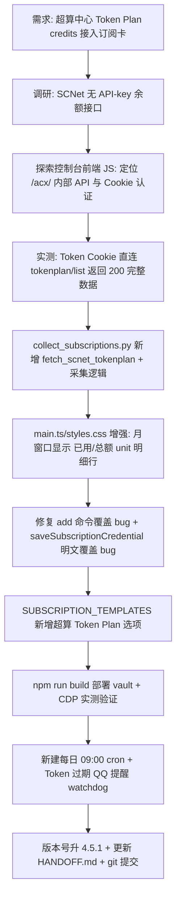

# HANDOFF — Smart Dashboard v4.5.1（SCNet Token Plan 订阅额度接入）

> 本次交接聚焦：订阅额度卡接入第 2 个数据源 SCNet（国家超算互联网）Token Plan，含登录态 Cookie 认证、credits 明细展示、每日采集 cron 与 watchdog 提醒。三端版本对齐 ship 惯例（manifest.json / package.json / HANDOFF.md 均 4.5.1）。严格套用《06_项目交接文档模板》8 节结构。

## 1. 项目概况与当前状态
- **项目名称：** Smart Dashboard（Obsidian 插件，id: `obsidian-smart-dashboard`）
- **项目目标：** 在 Obsidian 侧边栏提供统一智能看板，聚合日历/待办/日程/Token 用量/订阅额度等卡片，以 Knowledge OS 方式整合笔记与时间管理。
- **当前阶段：** SCNet Token Plan 订阅额度接入完成，`collect_subscriptions.py` / `main.ts` / `styles.css` / `main.js` 均已改好并部署到 vault；CDP 实测卡片渲染无裁切、添加订阅弹窗含超算选项；每日 09:00 cron（`5fb9ce1ed6e4`）已建并手动触发验证 ok。
- **版本：** 交接版本 **v4.5.1**（manifest.json 4.5.1 / package.json 4.5.1 / HANDOFF.md 4.5.0→4.5.1 三端对齐）；日期 **2026-08-20**
- **作者：** kroetz　**仓库：** https://github.com/billikroetzlyr43-eng/obsidian-smart-dashboard　**分支：** main

## 2. 任务执行全流程结构图 (Mermaid Workflow)

## 3. 治理/交付核心成果与数据对比 (Metrics & Data Comparison)
| 指标/维度 | 治理/执行前状态 | 治理/执行后状态 | 优化效果与说明 |
| :--- | :---: | :---: | :--- |
| **订阅额度数据源数** | 1（OpenCode Go） | **2（+SCNet Token Plan）** | 新增超算中心 Token Plan credits 采集 |
| **SCNet 套餐（2026-08-20 实测）** | 未接入 | **基础版，0 / 60000 credits，0% used** | 来自 `/acx/charge/account/currentuser/tokenplan/list` |
| **订阅卡月窗口展示** | 仅百分比（如 `0%`） | **百分比 + `已用/总额 unit` 明细行** | 新 class `sd-subscriptions-window-detail`（styles.css） |
| **凭证存储** | 卡片 ➕ 添加时**明文覆盖** | **加密存储 + 字段合并** | 修复 saveSubscriptionCredential 明文覆盖 bug；改用 Python `add` 命令 |
| **add 命令行为** | 整体覆盖 provider 凭证（二次 add 丢字段） | **合并已有字段** | 修复 add_provider_config 覆盖 bug |
| **每日自动采集** | 无 | **cron `5fb9ce1ed6e4` 09:00 + Token 过期 QQ 提醒** | no_agent 纯脚本 watchdog，正常静默、失败提醒 |
| **受影响文件** | - | **6 + 2 新增** | collect_subscriptions.py / main.ts / styles.css / main.js / manifest.json / package.json / HANDOFF.md + 新增 scripts/scnet_daily_collect.py |

## 4. 已完成工作 (Completed)
- **核心功能/交付物：**
  - [x] `collect_subscriptions.py` 新增 `fetch_scnet_tokenplan()`（Cookie 认证直连 `/acx/charge/account/currentuser/tokenplan/list`），返回 `provider: scnet-tokenplan` + monthly 窗口（percent/usedAmount/totalAmount/unit/status/resetsAt）
  - [x] `main.ts` 订阅卡月窗口新增 `sd-subscriptions-window-detail` 明细行（`已用 / 总额 unit`）；`SUBSCRIPTION_TEMPLATES` 新增 `scnet-tokenplan` 选项（🖥️ 超算 Token Plan）
  - [x] `styles.css` 新增 `.sd-subscriptions-window-detail` 样式（9px/muted/ellipsis）
  - [x] 修复 `add_provider_config` 覆盖 bug（改为合并已有 credentials）
  - [x] 修复 `saveSubscriptionCredential` 明文覆盖 bug（改调 Python `add` 命令，走加密+合并）
  - [x] 新增 `D:/Hermes/scripts/scnet_daily_collect.py`（每日采集 + Token 过期检测 + QQ 提醒 watchdog）
  - [x] 新建 cron `5fb9ce1ed6e4`（每天 09:00，no_agent，deliver qqbot）并手动触发验证 ok（silent）
  - [x] 版本号三端升 4.5.1（manifest.json / package.json / HANDOFF.md）
- **关键代码/文件路径：**
  - `D:/workspace/01_Projects/obsidian-smart-dashboard/collect_subscriptions.py` — `SCNET_TOKENPLAN_LIST_URL`(L35) / `SCNET_APIKEY_QUERY_URL`(L36) / `fetch_scnet_tokenplan()`(L263-330) / `add_provider_config` 合并修复(L106-131) / main() 采集分支(L428-441)
  - `D:/workspace/01_Projects/obsidian-smart-dashboard/main.ts` — `SUBSCRIPTION_TEMPLATES.scnet-tokenplan`(L81-86) / 月窗口 detail 行(L3043-3050) / `saveSubscriptionCredential` 加密改造(L2939-2972)
  - `D:/workspace/01_Projects/obsidian-smart-dashboard/styles.css` — `.sd-subscriptions-window-detail`(L1042-1051)
  - `D:/Hermes/scripts/scnet_daily_collect.py` — 每日采集 watchdog（新增）
  - `main.js` — 构建产物（已部署 `D:/Obsidian Vault/Obsidian Vault/.obsidian/plugins/obsidian-smart-dashboard/`）
- **技术方案与架构：**
  - **SCNet 无 API-key 余额接口**：`sk-tp-` 专属 key 只能调模型（`/api/llm/v1/models` 200），所有 `api.scnet.cn` 余额端点（usage/balance/billing）返回 401「用户未登录」——credits 查询只能走控制台网页登录态
  - **认证**：Cookie `Token=<uuid>`（base64 编码 UUID，非 HttpOnly，可从 `document.cookie` 读）+ 可选 `userName`，访问 `www.scnet.cn/acx/` 前缀内部 API
  - **数据接口**：`/acx/charge/account/currentuser/tokenplan/list` 直接返回套餐（`name`/`usedAmount`/`totalAmount`/`unit`/`status`/`maxExpireTime`）；`/acx/llm/api-key/token-plan/query` 返回专属 key + Base URL
  - **cron watchdog**：no_agent 模式，stdout 空=静默成功；仅 Token 过期时输出提醒投递 QQ（6 小时去重）

## 5. 待办事项与下一步行动 (Next Steps)
- **⚡ 优先级最高（启动后立即执行）：**
  - [ ] 完成本次 git 提交（collect_subscriptions.py / main.ts / styles.css / main.js / manifest.json / package.json / HANDOFF.md / 新脚本 scnet_daily_collect.py）并由监督方处理 push
- **📌 后续规划：**
  - [ ] 观察 SCNet Token 登录态有效期（过期后 cron watchdog 应触发 QQ 提醒，验证链路）
  - [ ] 评估 `usage/amount` 接口（需 `accountId`+`startTime`+`endTime` 参数）是否补充按模型/按日用量明细展示
  - [ ] 考虑 `userName` 是否通过弹窗录入（当前 SCNet 添加只需 Token，userName 可选）
  - [ ] 更新知识库 `00_System/06_个人偏好与长期记忆/04_当前长期项目状态.md` 与 Smart Dashboard 版本事实

## 6. 踩坑记录与避坑指南 (Lessons Learned & Pitfalls)
- **已踩过的坑：**
  - **[v4.5.1 新增] SCNet 无 API-key 余额接口**：`sk-tp-` key 只能调模型，所有余额端点 401「用户未登录」。DeepSeek 那种 `GET /user/balance` API-key 方案在 SCNet **不适用**——GitHub 项目（如 `jryang1997/hermes-opencode-go-quota`）的 OpenCode Go 模式（登录态 Cookie 抓取）才是正确参照
  - **[v4.5.1 新增] Edge 151 App-Bound 加密**：复制 Edge profile 到临时目录启动 CDP 无法解密 cookie/localStorage（登录态丢失跳转 sso/login）——不能用 edge-cdp-driver 复制登录态方案。改用"用户在已登录浏览器 F12 Console 读 `document.cookie` 拿 Token"方案
  - **[v4.5.1 新增] collect_subscriptions.py `add` 命令覆盖 bug**：原 `add_provider_config` 整体替换 provider 凭证，第二次 `add` 丢第一次字段（实测第二次 add userName 覆盖了 token）→ 已改为合并
  - **[v4.5.1 新增] main.ts `saveSubscriptionCredential` 明文覆盖 bug**：卡片 ➕ 添加凭证时直接明文写 JSON 且整体覆盖 provider 配置（绕过 Python 加密、丢已有字段）→ 已改调 Python `add` 命令
  - **Obsidian 需完全重启（非热加载）**：热加载/Reload 插件不会刷新采集合并逻辑，必须完全退出 Obsidian 进程后重启（CDP 实测：`obs_cdp_restart.py` 重启后订阅卡才显示超算条目）
  - **cdp 截图保存路径坑**：`obs_cdp_shot.js` 截图文件受 cwd 影响可能存到非预期位置；用绝对路径 + `fs.statSync` 验证
- **已知 Bug / 限制：**
  - 🐛 SCNet Token 登录态会过期（需重新登录控制台更新 cookie）——cron watchdog 会在过期时 QQ 提醒，但更新需手动（无 API 方式绕开）
  - 🐛 订阅卡 detail 行在 2×1 卡片（612×300px）内实测无裁切（scrollH==clientH==262），但若日后加更多 provider 或更长文本需复查高度

## 7. 项目规范与硬性约束 (Rules & Constraints)
- **代码/文件规范：**
  - 提交身份固定为 kroetz；远端 origin 已配凭据 store
  - commit message 遵循 `vX.Y.Z: 描述` 格式
  - 构建命令 `npm run build`；产物 main.js + manifest.json + styles.css 三件套自动部署 vault 插件目录
  - Python 采集脚本输出固定写到 `D:/Obsidian Vault/Obsidian Vault/.smart-dashboard/`；凭证加密存储于 `subscriptions_config.json`（机器绑定 XOR+Base64）
  - cron 脚本目录 `D:/Hermes/scripts/`；watchdog 状态文件 `.scnet_token_expired.json` 同目录
  - `__pycache__/`、`*.bak*`、`TASK*.md`、`data.json` 不入库
- **业务/逻辑底线：**
  - 凭证**必须加密存储**（走 Python `encrypt_value`），禁止前端明文写配置
  - `add` 命令**合并**凭证字段，禁止整体覆盖
  - 三端版本对齐 ship 惯例：manifest.json / package.json / HANDOFF.md 版本号必须一致
  - SCNet 采集仅用**登录态 Cookie**，不把 `sk-tp-` API key 当余额查询凭证（会 401）

## 8. 断点快照 (Current State Snapshot)
- **上次停下的位置：**
  - 代码改动已完成并部署：`collect_subscriptions.py`（fetch_scnet_tokenplan / add 合并修复）、`main.ts`（SCNet 模板 + detail 行 + saveSubscriptionCredential 加密）、`styles.css`（detail 样式）、`main.js`（已部署 vault）
  - CDP 实测验证通过：订阅卡显示 2 项（OpenCode Go + 超算 基础版 0/60000 credits，无裁切）；添加订阅弹窗含"超算 Token Plan"选项（标题/提示/输入框均正常）
  - cron `5fb9ce1ed6e4` 已建（每天 09:00，no_agent，deliver qqbot），手动 run 验证 ok（silent）
  - 版本号已升 4.5.1（manifest.json / package.json 已改，HANDOFF.md 同步中）
  - 备份文件：`collect_subscriptions.py.bak_20260820` / `main.ts.bak_20260820`（.gitignore 排除，不入库）
- **遗留待确认问题：**
  - [待确认] SCNet Token 登录态有效期（预估几天~几周，过期后 cron watchdog 应触发 QQ 提醒）
  - [待确认] 本次 git 提交后本地与远程 sha 对齐（沿用 v4.5.0 的 REST API push 流程）
  - [待确认] `usage/amount` 接口的 `startTime`/`endTime` 参数格式（前端代码里 time 格式待进一步确认，当前 tokenplan/list 已够展示）

---

> 关联工作流：[[10_项目交接与上下文维持工作流]]

---

## 附录：历史版本摘要
- **v4.5.0**：Token 卡接入 CodeBuddy 第 5 源（parse_codebuddy / schema v5 / 三处合并函数并入 codebuddy）
- **v4.4.0**：Token 卡接入 WorkBuddy 第 4 源（parse_workbuddy / schema v4 / 三处合并函数并入 workbuddy）
- **v4.3.3**：Token 卡小分类只显示输入+输出；刷新保留面板不清空、状态文字移按钮右侧
- **v4.3.2**：移除主题切换按钮；Token 卡刷新直连采集（去 cron）
- **v4.3.1**：深色模式文字显示不清修复（颜色源统一为 Obsidian 核心变量）
- **v4.3.0**：卡片开关与自动补位布局（`SmartDashboardSettingTab` + `reflowLayoutForVisibleCards`）
